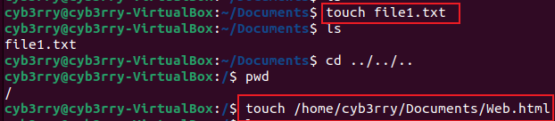

# basic-linux-commands
In this project, some of the basic commands used while in the linux terminal will be discussed

## 💻 **Linux Commands and Syntax**

### 🔹 **What are Linux Commands?**

Linux commands are text-based instructions you type into a **terminal** to interact with the operating system. They are used for tasks like:
- Navigating files and directories
- Managing software
- Setting permissions
- Monitoring system performance
- Controlling services and users

---

## 🔤 **General Command Syntax:**

```bash
command [options] [arguments]
```

- **command** – The name of the program or utility (e.g., `ls`, `cd`, `mkdir`)
- **options** – Optional flags to modify behavior (e.g., `-l`, `-a`)
- **arguments** – The targets or inputs for the command (e.g., filenames, directories)

---

### 📘 **Examples:**

| Command                          | Meaning                                   |
|----------------------------------|-------------------------------------------|
| `ls -l /home/user`               | List files in long format in `/home/user` |
| `cd Documents`                   | Change to the `Documents` directory       |
| `mkdir new_folder`              | Create a new directory                    |
| `rm file.txt`                    | Remove a file                             |
| `sudo apt install nginx`         | Install Nginx using apt with root access  |
| `chmod +x script.sh`             | Make a script executable                  |
| `top`                            | Show live system processes                |

---

### 🔐 Common Prefixes:

- `sudo` – Run a command with **superuser (admin)** privileges
- `./` – Run a file/script in the current directory

---

## 🧠 Tips:
- Use `man <command>` to see a command's manual/help page.
- Use `--help` with most commands to see usage info (e.g., `ls --help`).

---

## 🔑 **What is the `sudo` Command?**

`sudo` stands for **SuperUser Do**, and it allows a **normal user** to run commands with **superuser (root) privileges**.

### Why is it Important?
In Linux and other Unix-like systems, **root** is the system's superuser with full access to everything. However, allowing all users to have root access can be risky. Instead, `sudo` allows users to run commands that require administrative access **without being logged in as root**.

Using `sudo` ensures that you have the necessary privileges for tasks like installing software, changing system configurations, or managing system processes.

---

## 🔧 **How to Use `sudo`**

The basic syntax for `sudo` is:

```bash
sudo command [options] [arguments]
```

- **command** – The command you want to run (e.g., `apt install`, `chmod`, `reboot`)
- **options** – Optional flags for the command
- **arguments** – The input or target of the command (e.g., a file or directory)

### 📝 **Example Use Cases:**

1. **Install software:**
   ```bash
   sudo apt update   # Update package list
   sudo apt install git  # Install Git
   ```

2. **Change file permissions:**
   ```bash
   sudo chmod 755 /usr/bin/examplefile
   ```

3. **Reboot the system:**
   ```bash
   sudo reboot
   ```
4. Creating a directory named `example` in the root folder as a non-root user
```bash 
mkdir /root/example
```
- It throws an error becuase permission wasnt granted:
```bash
mkdir: cannot create directory ‘/root/example’: Permission denied
```
- To curb this, the `sudo` command can be used:
```bash
sudo mkdir /root/example
```
- Check that the folder was truly created: 
```bash
sudo ls /root
```
- In order to check the directory path you are working on, the `pwd` command can be used:
```bash
pwd
```

---

## 💡 **Important Points:**

- **Password prompt:** The first time you run `sudo` in a session, it asks for your user **password** (not the root password). This ensures that the person running the command has permission to do so.
  
- **Timeout:** Once you enter your password, `sudo` remembers it for a short period (typically 5-15 minutes) to avoid asking for the password multiple times during that window.

- **Security:** Using `sudo` is safer than logging in directly as the root user because it allows you to run specific commands with elevated privileges, rather than granting full access to everything.

---

## 🚨 **Caution:**
- Be careful when using `sudo`, as it gives you the ability to modify important system files and settings. Improper use of `sudo` can damage your system or make it unbootable.
- **Double-check commands** (especially with destructive ones like `rm`, `dd`, or `reboot`) before running them with `sudo`.

---

### ✨ **Example of `sudo` Misuse:**

```bash
sudo rm -rf /  # This command would delete everything on your system!
```

Always ensure you're clear on what the command is doing before running it with `sudo`.

---

## **Linux Directory Structure Overview**

The **Linux directory structure** is a hierarchical file system used to organize the files and directories on a Linux system. It is designed to provide a unified and logical arrangement for files, making it easier to locate, manage, and work with them. This structure follows the **Filesystem Hierarchy Standard (FHS)**.

Here’s a brief overview of the major directories and their roles in Linux:

---

## 📂 **Linux Directory Tree**

```
/
├── bin/            # Essential command binaries
├── boot/           # Boot loader files (grub, kernel)
├── dev/            # Device files (e.g., hard drives, USB devices)
├── etc/            # System configuration files
├── home/           # User home directories (e.g., /home/user)
├── lib/            # Shared libraries and kernel modules
├── media/          # Mount points for removable media (e.g., USB)
├── mnt/            # Mount points for temporarily mounted filesystems
├── opt/            # Optional application software packages
├── proc/           # Virtual files representing system/proc information
├── root/           # Home directory for root user (superuser)
├── run/            # Runtime data (e.g., process IDs)
├── sbin/           # System binaries (admin commands)
├── srv/            # Service data (e.g., web server files)
├── sys/            # Virtual filesystem for kernel and system info
├── tmp/            # Temporary files
├── usr/            # User programs and files
├── var/            # Variable data (e.g., log files, databases)
```

---

## 🗂️ **Key Directories and Their Functions:**

### 1. **`/` (Root Directory)**  
The top-level directory in Linux, containing all system files and directories.

### 2. **`/bin`**  
Contains essential binary files (programs and commands) required for the system to function, such as `ls`, `cp`, and `cat`.

### 3. **`/boot`**  
Stores bootloader files, the Linux kernel (`vmlinuz`), and initial ramdisk (`initrd`), which are needed to start the system.

### 4. **`/dev`**  
Contains device files for hardware devices like disks, printers, and USB devices. For example, `/dev/sda` refers to the first hard disk.

### 5. **`/etc`**  
Holds system-wide configuration files. For example, `/etc/passwd` contains user account information, and `/etc/fstab` contains disk mounting information.

### 6. **`/home`**  
Contains personal directories for regular users. For example, `/home/user` is the home directory for a user named "user."

### 7. **`/lib`**  
Contains shared libraries that are needed by programs in `/bin` and `/sbin`. These are equivalent to DLL files on Windows.

### 8. **`/media`**  
Mount points for removable media such as CDs, DVDs, USB drives. For example, when you plug in a USB stick, it might appear as `/media/usb`.

### 9. **`/mnt`**  
Historically used for temporary mounting of filesystems (e.g., mounting an external hard drive). It's often empty unless the user mounts something.

### 10. **`/opt`**  
Used for **optional software packages** that are not part of the system's default package management system (e.g., third-party applications).

### 11. **`/proc`**  
A virtual filesystem that provides information about the system's running processes. For example, `/proc/cpuinfo` shows CPU information, and `/proc/meminfo` provides memory details.

### 12. **`/root`**  
The **home directory** for the **root (superuser)**. This is different from `/home` and is typically used for administrative tasks.

### 13. **`/run`**  
Contains runtime data that is required during system operation, such as process IDs and system sockets.

### 14. **`/sbin`**  
Contains system binaries essential for system maintenance and administration (e.g., `reboot`, `fsck`). Usually, only the root user will need to use these.

### 15. **`/srv`**  
Contains service data. For example, `/srv/www` might contain web server files for a website.

### 16. **`/sys`**  
Another virtual filesystem that provides information about system devices, kernel parameters, and other system settings.

### 17. **`/tmp`**  
Temporary files are stored here. This directory is usually cleaned up on reboot, so don't store important files here.

### 18. **`/usr`**  
Contains user programs and files. For example, `/usr/bin` has non-essential programs, `/usr/lib` contains libraries, and `/usr/share` has shared resources like documentation and man pages.

### 19. **`/var`**  
Contains files that are expected to change frequently, such as log files (`/var/log`), spool directories (`/var/spool`), and databases.

---
Used `cd` to navigate to and explore some of these directories starting with the `root(/)` directory
```bash
cd /
```
- To confirm that you are there, use the `pwd` command
- To list the contents of this directory, use `sudo ls -l`
- Navigate further to the `usr` directory using `sudo cd /usr
`


; commands used:
```bash
sudo mkdir photos
cd photos
sudo mkdir photo1
sudo mkdir photo2
sudo mkdir photo3
ls
cd photo1
pwd
```
## 📈 **Summary:**
- The **Linux directory structure** is hierarchical and starts from the root directory `/`.
- Each directory serves a specific purpose, from system configuration (`/etc`) to user data (`/home`).
- Understanding this structure is key to navigating and managing a Linux system.

---

## 📁 `ls` Command Flags (Short Notes)

The `ls` command lists files and directories in the current location. You can use **flags** to customize the output.

| **Flag** | **Usage**             | **Description**                            |
|----------|------------------------|--------------------------------------------|
| `-l`     | `ls -l`                | Lists in **long format** (with permissions, size, etc.) |
| `-a`     | `ls -a`                | Shows **all files**, including hidden ones (`.` prefix) |
| `-h`     | `ls -lh`               | Displays **file sizes in human-readable format** |
| `-R`     | `ls -R`                | Recursively lists all subdirectories       |
| `-t`     | `ls -lt`               | Sorts files by **modification time**       |
| `-r`     | `ls -lr`               | Reverses the order of listing              |

You can combine flags like so: `ls -lah`

---

## 📝 `cat` Command (Concatenate and Display Files)

### **Usage:**
```bash
cat filename.txt
```
### *Example:*
```bash
sudo cat /etc/os-release
```


### **Purpose:**
- Displays the contents of a file
- Combines multiple files into one
- Creates new files with redirected output
---

## 📄 `cp` Command (Copy Files and Directories)

### **Usage:**
```bash
cp source destination
```

### **Purpose:**
- Copies files or directories from one location to another

### **Common Flags:**
- `-r` – Recursively copy directories
- `-i` – Prompt before overwriting
- `-v` – Verbose mode (show progress)

### **Example:**
```bash
cp filename.txt /home/ubuntu/Documents
cp filename1.txt filename2.txt filename3.txt /home/username/Documents
cp filename1.txt filename2.txt
cp -R /home/username/Documents /home/username/Documents_backup

```
---

## 📂 `mv` Command (Move or Rename Files)

### **Usage:**
```bash
mv source destination
```

### **Purpose:**
- Moves files or directories to another location
- Also used to **rename** files

### **Common Flags:**
- `-i` – Prompt before overwrite
- `-v` – Verbose output

### **Examples:**
```bash
mv filename.txt /home/ubuntu/Documents
mv old_filename.txt new_filename.txt
```


### 🗑️ `rm` – *Remove Files or Directories*

**Usage:** `rm [options] file(s)`

| **Flag** | **Function**                       |
|----------|------------------------------------|
| `-r`     | Recursive: delete directories too  |
| `-f`     | Force delete (no prompt)           |
| `-i`     | Prompt before every removal        |
| `-v`     | Verbose (show what's deleted)      |

**Examples:**
- Delete file: `rm file.txt`
- Delete folder: `rm -r foldername/`
- Force delete: `rm -rf /tmp/junk/`

### **Examples:**
```bash
rm filename
rm filename1 filename2 filename3
```
> ⚠️ **Caution**: `rm` is irreversible—especially with `-rf`.
---


## 🟦 `touch` – *Create or Update Files*

### 📌 **Purpose:**
- **Creates** a new, empty file if it doesn’t exist.
- **Updates** the **timestamp** (last modified time) of an existing file.

### 🔹 **Usage:**
```bash
touch filename.txt
```

### 🔸 **Examples:**
- Create a new file:
  ```bash
  touch report.txt
  touch /home/ubuntu/Documents/Web.html
  ```
- Update timestamp of multiple files:
  ```bash
  touch file1.txt file2.txt
  ```


> 🔔 Tip: `touch` is often used in scripting to generate placeholder files.

---

## 🟩 `find` – *Search for Files and Directories*

### 📌 **Purpose:**
- Search for files and directories based on name, type, size, modification date, and more.

### 🔹 **Usage:**
```bash
find [path] [options] [expression]
```
### 🔸 **Examples:**

- Find a file by name:
  ```bash
  find /home/user -name "notes.txt"
  ```

- Find all `.log` files:
  ```bash
  find /var/log -type f -name "*.log"
  ```

- Find and delete all `.tmp` files:
  ```bash
  find . -type f -name "*.tmp" -delete
  ```

> 🔍 `find` is powerful for locating, filtering, and performing actions on files.

---


